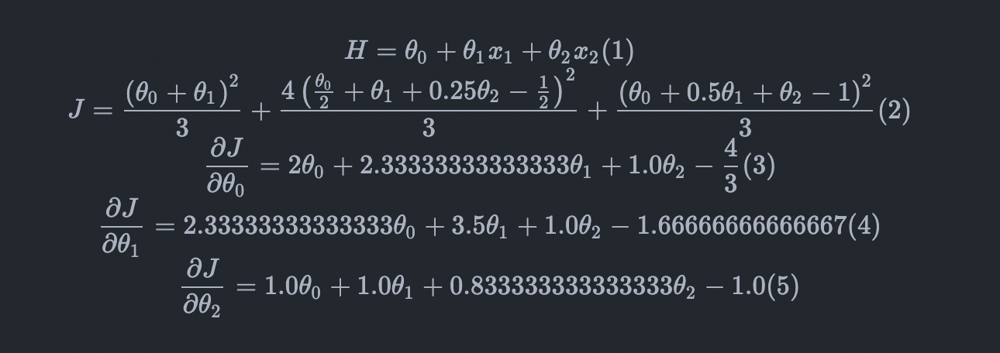

# Assignment 1

## Q1

## Q2

### a. Code for map worker

```java
/**
 * key: file name
 * value: file content (comma separated triples)
 */
map(String key, Text value) {
 // do pre-processing...
 for (Triple triple : value) {
  // output
  // key: vertex
  // value: a weight, either outgoing or incoming
  emit(triple[0], triple[2]) // outgoing weight for first vertex
  emit(triple[1], triple[2]) // incoming weight for second vertex
 }
}
```

### b. Code for reduce worker

```java
/**
 * key: vertex
 * value: an iterator over all weights
 */
reduce(int key, Iterator<Double> value) {
 double sum = 0
 for (double v : value) 
  sum += v

 // output
 // key: vertex
 // value: sum of weights for incoming and outgoing edges
 emit(key, sum)
}
```

## Q3

### a. Relation between MapReduce and Hadoop

MapReduce is a framework/algorithm for processing big data.

Hadoop is a platform for distributed processing of big data. Its top level component - Hadoop MapReduce - is an open source implementation of the MapReduce model. 

### b. Map worker

```java
/**
 * key: file name
 * value: file content (comma separated tuples <String, int>)
 */
map(String key, Text value) {
 // do pre-processing...
 for (Tuple tuple : value) {
  // output
  // key: student name
  // value: grade of a subject
  emit(tuple[0], tuple[1])
 }
}
```

### c. Reduce worker

```java
/**
 * key: student name
 * value: an iterator over all grades of a student
 */
reduce(String key, Iterator<Integer> value) {
 int sum = 0
 for (int v : value) 
  sum += v

 // output
 //  key: student name
 // value: total grades of the student
 emit(key, sum)
}
```

### d. concrete inputs/outputs (in JSON)

Input to map worker

```json
{
 "math.txt": "James, 91\nJohn, 89\nRobert, 72\nMichael, 81\nDavid, 76\nMary, 79\nLinda, 63\nSusan, 67\nLisa, 76\n",
 "physics.txt": "James, 57\nJohn, 78\nRobert, 68\nMichael, 71\nDavid, 79\nMary, 69\nLinda, 79\nSusan, 76\nLisa, 74\n",
 "chemistry.txt": "James, 78\nJohn, 92\nRobert, 68\nMichael, 91\nDavid, 77\nMary, 74\nLinda, 89\nSusan, 87\nLisa, 92\n",
 "art.txt": "James, 67\nJohn, 89\nRobert, 88\nMichael, 87\nDavid, 68\nMary, 79\nLinda, 94\nSusan, 78\nLisa, 91\n"
}
```

Output from map worker

```json
{
 "James": 91,
 "James": 57,
 "James": 78,
 "James": 67,
 "John": 89,
 "John": 78,
 "John": 92,
 "John": 89,
 "Robert": 72,
 "Robert": 68,
 "Robert": 68,
 "Robert": 88,
 "Michael": 81,
 "Michael": 71,
 "Michael": 91,
 "Michael": 87,
 "David": 76,
 "David": 79,
 "David": 77,
 "David": 68,
 "Mary": 79,
 "Mary": 69,
 "Mary": 74,
 "Mary": 79,
 "Linda": 63,
 "Linda": 79,
 "Linda": 89,
 "Linda": 94,
 "Susan": 67,
 "Susan": 76,
 "Susan": 87,
 "Susan": 78,
 "Lisa": 76,
 "Lisa": 74,
 "Lisa": 92,
 "Lisa": 91
}
```

Input to reduce worker

```json
{
 "James": [91, 57, 78, 67],
 "John": [89, 78, 92, 89],
 "Robert": [72, 68, 68, 88],
 "Michael": [81, 71, 91, 87],
 "David": [76, 79, 77, 68],
 "Mary": [79, 69, 74, 79],
 "Linda": [63, 79, 89, 94],
 "Susan": [67, 76, 87, 78],
 "Lisa": [76, 74, 92, 91]
}
```

Output from reduce worker

```json
{
 "James": 293,
 "John": 348,
 "Robert": 296,
 "Michael": 330,
 "David": 300,
 "Mary": 301,
 "Linda": 325,
 "Susan": 308,
 "Lisa": 333
}
```

## Q4



The update should be `-1.33333333333333 -1.75000000000000 -0.416666666666667` respectively.

The target function can be expressed as (1). The loss function can be expressed as (2) with respect to the three data points. The three partial derivatives are calculated in (3), (4) and (5).

The initial assignment to *w* is [0.5, 0.5, 0.5]. Substituting thetas in (3), (4), (5) we can get the gradient vector `delta(w)` = `[1.33333333333333 1.75000000000000 0.416666666666667]`. Taking sign and the step hyperparameter into account (1), the update is `-1.33333333333333 -1.75000000000000 -0.416666666666667`
for three parameters respectively.
